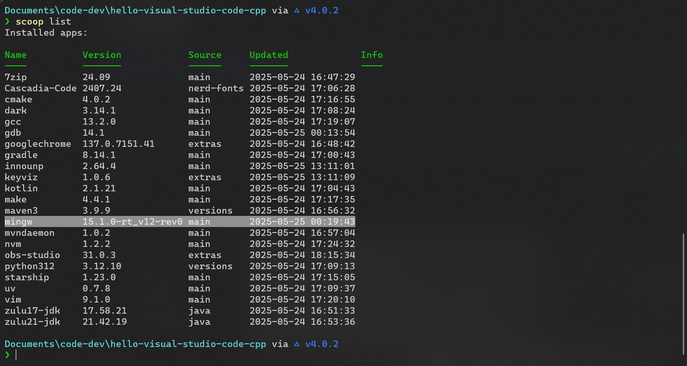
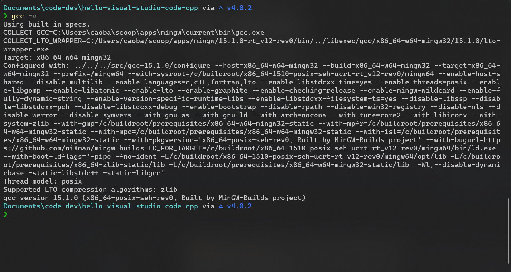
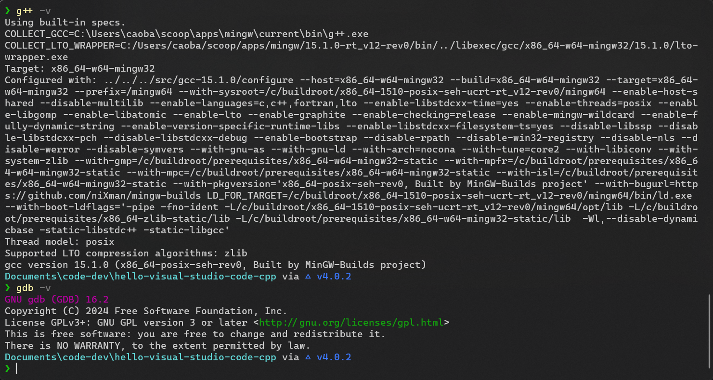
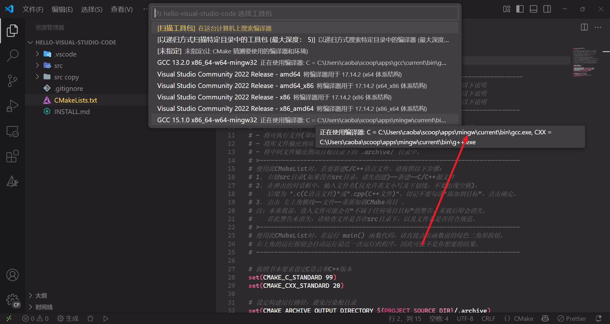
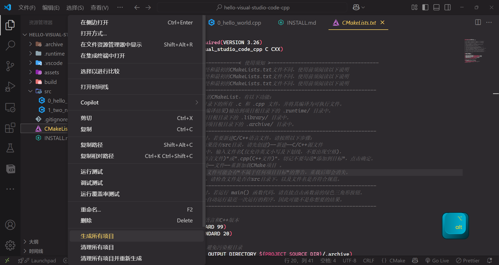

# mingW

```shell
scoop install main/mingw
```



验证

```shell
gcc -v
```



```shell
g++ -v
gdb -v
```



配置



使用

```tex
cmake_minimum_required(VERSION 3.26)
project(hello_visual_studio_code_cpp C CXX)

# --------------------------< 使用须知 >------------------------------------
# 请注意： 此文件已经和最初的CMakeLists.txt文件不同，使用前须阅读以下说明
# 请注意： 此文件已经和最初的CMakeLists.txt文件不同，使用前须阅读以下说明
# 请注意： 此文件已经和最初的CMakeLists.txt文件不同，使用前须阅读以下说明
# >-----------------------------------------------------------------------
# 本文件是一个自动化的CMakeList，有以下功能：
# - 自动遍历 src 目录下的所有 .c 和 .cpp 文件，并将其编译为可执行文件。
# - 将可执行文件(即编译结果)输出到项目根目录下的 .runtime/ 目录中。
# - 将库文件输出到项目根目录下的 .library/ 目录中。
# - 将中间文件输出到项目根目录下的 .archive/ 目录中。
# >-----------------------------------------------------------------------
# 使用此CMakeList时，若要新建C/C++语言文件，请按照以下步骤：
# 1. 右键src目录(如果没有src目录，请先创建)——新建——C/C++源文件
# 2. 在弹出的对话框中，输入文件名(仅允许英文小写及下划线，不要出现空格)，
#    后缀为 ".c(C语言文件)"或".cpp(C++文件)"，切记不要勾选“添加到目标”，点击确定。
# 3. 点击 左上角横线——文件——重新加载CMake项目 。
# 注：未重载前，进入文件可能会有“不属于任何项目目标”的警告，重载后即会消失。
#    若此警告未消失，请检查文件是否在src目录下，以及文件名是否符合规范。
# >-----------------------------------------------------------------------
# 使用此CMakeList时，若运行 main() 函数代码，请直接点击函数前的绿色三角形按钮。
# 右上角的运行按钮会自动运行最近一次运行的程序，因此可能不是你想要的结果。
# ------------------------------------------------------------------------

# 按照书本要求设定C语言和C++版本
set(CMAKE_C_STANDARD 99)
set(CMAKE_CXX_STANDARD 20)

# 设定构建运行路径，避免污染根目录
set(CMAKE_ARCHIVE_OUTPUT_DIRECTORY ${PROJECT_SOURCE_DIR}/.archive)
set(CMAKE_LIBRARY_OUTPUT_DIRECTORY ${PROJECT_SOURCE_DIR}/.library)
set(CMAKE_RUNTIME_OUTPUT_DIRECTORY ${PROJECT_SOURCE_DIR}/.runtime)
set(EXECUTABLE_OUTPUT_PATH ${PROJECT_SOURCE_DIR}/.runtime)
set(LIBRARY_OUTPUT_PATH ${PROJECT_SOURCE_DIR}/.library)

include_directories(${PROJECT_SOURCE_DIR}/src)

# 遍历项目src目录下所有的 .c 文件，自动添加
file(GLOB_RECURSE files src/*.c src/*.cpp)
foreach (file ${files}) # 遍历所有发现的文件
    get_filename_component(name ${file} NAME) # 获取文件名
    add_executable(${name} ${file}) # 添加可执行文件
endforeach () # 遍历结束
```




